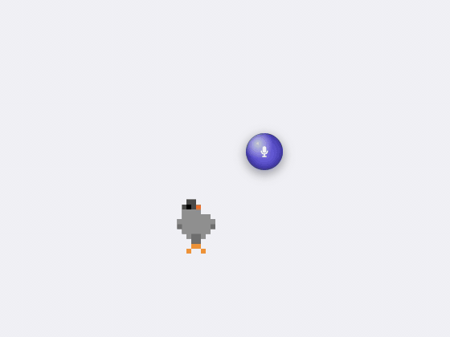
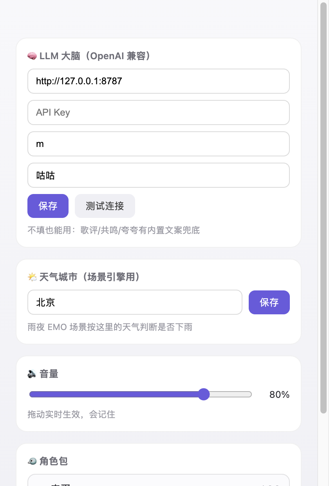
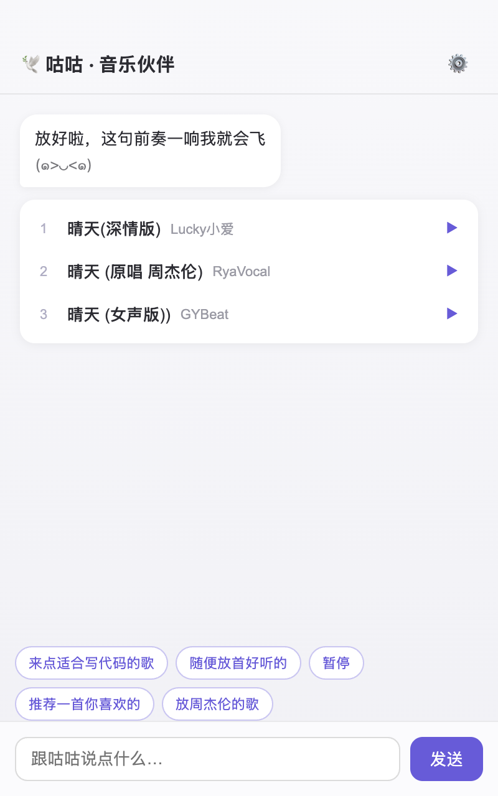

# 🕊️ 咕咕音乐桌宠 · Gugu Music Pet

> 一只会在你 macOS 桌面上生活、聊天、放歌、随音律跳舞的鸽子 —— 把 2021 年的 Windows 桌宠「咕咕」复活成懂音乐的 AI 伙伴。



Electron + TypeScript + PixiJS · LLM 工具调用 · 网易云音乐全链路 · 实时节拍检测

---

## 它能做什么

| | |
|---|---|
| 🎮 **桌宠交互** | 透明置顶 + 点击穿透 + 拖拽投掷物理（弹墙、落地挤压回弹），摸头出爱心，闲时呼吸/眨眼/溜达 |
| 🧠 **音乐 Agent** | 双击聊天：「来点适合写代码的歌」→ LLM tool-calling 自动搜歌、放歌、聊音乐；Markdown 长期记忆 + 四维驱动力（能量/社交/好奇/安逸）让它有自己的节律 |
| 🎵 **汽水音乐全链路** | 搜索、加密音频解密取链（本地 sidecar 代理流）、LRC 歌词、封面；可选粘贴 Cookie 解锁完整曲库 |
| 💃 **随音律舞动** | Web Audio 低频 flux 节拍检测，实测 BPM 113/114 精准命中；帧动画 × 变换律动两层混合，任何角色包直接吃节拍 |
| 🎤 **伴唱夸夸** | 点右侧话筒圆球，你跟唱时它听着；唱完给出 AI 夸夸小结（无 LLM 也有内置文案兜底） |
| 🌧️ **EMO 场景引擎** | 雨夜/深夜它会走到角落自己听歌：♪哼歌气泡（实时歌词）、纯共鸣不评歌、音量变小氛围变暗；点它问「一起听吗？」接受后恢复 AI 歌评模式 |
| 💬 **热评卡轮播** | 左侧热评卡片轮播（汽水源暂无热评接口时展示兜底文案） |
| 🐣 **角色包热切换** | 咕咕（鸽子）/ 皮蛋（小鸡）一键切换，选择会记住；`source.json` 像素画 → 一条命令烘焙成角色包 |
| ⚙️ **设置面板** | 点击菜单栏托盘图标弹出毛玻璃面板（Keepresso 式）：顶部实时播放状态 + LLM / 天气城市 / 音量 / 角色包；宠物右键菜单也可进入 |





## 下载安装（macOS · Apple Silicon）

1. 下载 `dist/gugu-music-pet-<version>-arm64.dmg`（或从 Release 页），拖入「应用程序」
2. **首次打开**：本包未做开发者签名公证，双击若被拦，请**右键 → 打开 → 再点「打开」**（或系统设置 → 隐私与安全性 → 仍要打开）
3. 首次使用伴唱时系统会请求**麦克风权限**（用于听你跟唱），请允许
4. 右键宠物 → ⚙️ 设置：填入任意 **OpenAI 兼容 LLM**（推荐 DeepSeek / 智谱 GLM：Base URL + API Key + 模型名）→ 测试连接。不配也能玩，只是聊天/歌评走内置文案
5. 音乐源是**汽水音乐**（抖音系）：免登录即可搜索播放大部分内容；想解锁完整曲库，托盘菜单 → 登录汽水音乐 → 粘贴 Cookie（www.qishui.com 登录后 F12 取）

## 两分钟演示动线

1. 把鸽子拖起来扔出去 —— 弹墙、落地挤压（物理 + 动效）
2. 右键 → 「随机来一首」—— 头顶迷你播放器，**鸽子随节拍跳舞**（真实 BPM 检测）
3. 双击 → 聊天窗：「来点适合写代码的歌」→ 歌曲卡片 → 点卡片直接播
4. 右侧话筒圆球 → 跟唱 → AI 夸夸弹幕；摸头出爱心
5. 右键 → 「演示：雨夜EMO」—— 走到角落自听、♪哼歌、纯共鸣、变暗变安静 → 点它 → 「一起听吗？」
6. 右键 → 「看看热评」；托盘有播放控制
7. 右键 → 换成「皮蛋」（角色包热切换）

## 技术亮点

- **macOS 透明窗点击穿透**：主进程 40ms 轮询光标位置 vs 渲染层上报的交互区域，动态切换 `setIgnoreMouseEvents`，宠物身体可点、周围桌面完全穿透
- **`music://` 流代理**：音乐 CDN 直连有 CORS，AnalyserNode 会拿到静音；主进程用 undici 注册自定义协议代理音频流，节拍检测才有的吃
- **汽水音乐 sidecar**：汽水接口是字节私有协议，通过本地 go-music-api 子进程（`scripts/build-sidecar.sh` 编译，extraResources 随 app 分发）完成搜索与加密音频解密；歌曲 id 是 19 位大数，全链一律 string
- **CDN 403 自愈**：签名链接过期自动 Range 预检 + 重取一次，播放错误每曲自动跳下一首一次
- **节拍检测**：低频能量 flux + onset 不应期 + BPM 折半/加倍归一（60–180），中位数稳态输出；软相位对齐让弹跳永远踩点
- **两层动效模型**：帧动画层与精灵整体变换层（拉伸/挤压/摇摆）正交，新角色包零成本获得律动
- **LLM 可选设计**：Agent 工具链不依赖 LLM 可用性，歌评/共鸣/夸夸全部有内置兜底

## 架构速览

```
主进程 (src/main)          Electron 主进程：窗口/托盘/IPC 编排
  music/                   NetEase API + music:// 流代理 + 播放服务
  agent/                   brain（tool-calling 循环 ≤4 轮）/ prompt（T 人格）
                           scenes（EMO 场景引擎）/ memory（Markdown 记忆）/ drives（四维驱动力）
  settings.ts weather.ts   设置面板 IPC / Open-Meteo 免 key 天气

渲染层 (src/renderer)
  pet/                     Pixi 引擎 · physics（投掷物理）· beat（节拍）
                           audio（唯一 <audio> + Web Audio 图）· mic（伴唱）
  overlay/                 气泡 / 迷你播放器 / 话筒圆球 / 热评卡 / 右键菜单
  chat/ login/ settings/   聊天窗 / QR 登录 / 设置窗（React）

角色包 (characters/)       source.json 像素画 → npm run bake → 精灵图 + pack.json
```

数据流：托盘/场景引擎 → `music:command`/`pet:command` → 宠物窗执行；引擎/音频 → `music:report`/`pet:event` → 主进程大脑 → 回推气泡/卡片。

## 开发

```bash
# Node >= 22（.npmrc 已配国内镜像）；编译汽水 sidecar 需要 Go >= 1.25（scripts/build-sidecar.sh 自动装说明）
npm install
./scripts/build-sidecar.sh   # 编译汽水音乐 sidecar（首次必须）
npm run bake        # 烘焙角色包 + 图标素材
npm run dev         # 启动开发模式

npm test            # vitest 单测（物理积分 / 节拍检测 / 驱动力，33 个用例）
npm run typecheck
npm run dist        # 烘焙 + 构建 + electron-builder 打 dmg（arm64）
```

自动化端到端（CDP 驱动真实 app）：

```bash
npx electron-vite dev -- --remote-debugging-port=9222
node scripts/testing/mock-llm.mjs        # 本地 mock LLM（无需真实 key）
node scripts/testing/agent-e2e.mjs       # LLM 点歌全链路
node scripts/testing/settings-e2e.mjs    # 设置面板
node scripts/testing/music-e2e.mjs       # 网易云搜索/取链/热评
node scripts/testing/capture-demo.mjs    # 演示素材采集（GIF 帧 + 截图）
```

> 测试约定：先 `window.__guguAudio.setMuted(true)` 静音（节拍分析不受影响），不打扰扬声器。

## 项目身世

前世是 [gugu-desktop-pet](https://github.com/ccbili30-collab/gugu-desktop-pet)（Python/tkinter/Windows，2021）。本项目把它复活到 macOS：保留 T 人格提示词、四维驱动力与 Markdown 记忆格式（旧 `memory/` 目录可直接拷入续缘），重写全部交互、音频与 Agent 链路。

## License

MIT
